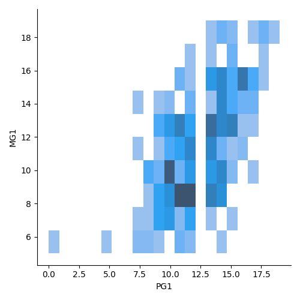

# ts24

## preparation

`pip install requirements.txt`

## task 1

Численные (num) и категориальные (cat) признаки:
|признак   |тип|
|----------|---|
|Subject   |cat|
|school    |cat|
|sex       |cat|
|age       |num|
|address   |cat|
|famsize   |cat|
|Pstatus   |cat|
|Medu      |cat|
|Fedu      |cat|
|Mjob      |cat|
|Fjob      |cat|
|reason    |cat|
|guardian  |cat|
|traveltime|cat|
|studytime |cat|
|failures  |num|
|schoolsup |cat|
|famsup    |cat|
|paid      |cat|
|activities|cat|
|nursery   |cat|
|higher    |cat|
|internet  |cat|
|romantic  |cat|
|famrel    |num|
|freetime  |num|
|goout     |num|
|Dalc      |num|
|Walc      |num|
|health    |num|
|absences  |num|
|cheating  |cat|
|G1        |num|
|G2        |num|
|G3        |num|

## task 2

После проверки количества пропущенных значений было установлено, что столбец cheating содержал 700 пропущенных значений, поэтому было целесообразно просто удалить его. Что касается строк romantic, famrel, Dalc и Walk, то количество пропущенных значений в этих столбцах было незначительным, поэтому были удалены лишь строки с пустыми ячейками. Эти действия не повлияют на обучение модели, т.к. для обучения мы планируем использовать XGboost, который может обрабатывать пропущенные значения.

## task 4

В первом полугодии наиболее часто встречается оценка "10" по всем предметам, больше всего плохих оценок (от "0" до "5") в предмете "Math" (разница в одну оценку)

Во втором полугодии по предмету "Por" наиболее часто встречается оценка "11", по предмету "Math" наиболее часто встречается оценка "9", заметна теденция ухудшения оценок, сильнее всего отразившаяся на предмете "Math" (в предмете "Por" кол-во плохих оценок увеличилось с 8 до 10, в предмете "Math" кол-во плохих оценок увеличилось с 9 до 29), больше всего плохих оценок также в предмете "Math" (разница уже в 19 оценок)

По предмету "Por" наиболее часто встречается итоговая оценка "11" по предмету "Math" наиболее часто встречается итоговая оценка "10", плохих итоговых оценок больше всего по предмету "Math" (46)

## task 5

### 5.1
Кореляции в числовых признаках есть между:

    образованием отца и матери (это, вероятно, связано с тем, что люди часто начинают романтические отношения в ВУЗах или СУЗах, где они учатся);

    временем, проводимым с друзьями, и временем, проводимым на улице в выходные (это связано с тем, что в выходные с друзьями проводят свобоное время те, у кого оно есть);

    временем, проводимым на улице в выходные и в будние дни (это связано с тем, что люди которые мало выходят на улицу в будние, мало выходят и в выходные);

    оценками в разных полугодиях (те, кто хорошо учился в первом полугодии, хорошо учатся и во втором);

Незначительные кореляции в числовых признаках есть между:

    возрастом учащегося и числом "завалов";

    свобоное время и время, проводимое с друзьями;

    оценками и образованием матери;

    оценками и образованием отца;

    оценками и количеством часов на учёбу;

### 5.2
Кореляции в категориальных признаках есть между:

    предметом, который изучает учащийся, и наличием репетитора у учащегося

    адресом учащегося и школой, которую он выбирает

## task 6

Время, проводимое на улице, напрямую влияет на успеваемость учеников. 50 человек с худшими баллами проводят большее количество времени на улице в будни и выходные.

50 человек с наилучшими результатами в основном проводят большую часть времени на улице в выходные, в будни длительность прогулок невысока.

## task 8

### 8.1

Идентифицировать обучающихся можно, сравнив их признаки. Один и тот же человек одинаково ответит на некоторые из вопросов. Такие признаки как "Subject", "G1", "G2", "G3", "G4",  "famrel", "freetime", "goout", "Dalc", "Walc", "absences", "cheating", "paid" зависят от изучаемого предмета или могут подвергаться субъективной оценке (например в один день опрашиваемый ответил, что отношения в семье 5, а в другой по какой либо причине - 4), поэтому их использовать нежелательно. Остальные признаки можно использовать для идентификации.

В итоге 305 учащихся изучали оба предмета.

### 8.2

Большинство учащихся, посещающих оба предмета, имеют средние оценки по обоим из них.

График G1 имеет перекос в право, т.е. оценки по природоведению у большинста учеников лежат в диапазоне 7-16, а по математике более разнообразны.

На графике G2 большинство оценок собрано в диапазонах 9-14 по природоведению и 6-15 по математике, при этом чётко обозначенных "двоечников" нет по природоведению, но они есть по математике.

На графике G3 видно, что большинство учащихся имеет оценки по обоим предметам выше 5, но по математике средние оценки ниже. Видно "двоечников" и по математике и по природоведению, при этом почти все из них имеют средние оценки по второму предмету.

## task 10

В качестве модели мы предлагаем использовать градиентый бустинг, реализацию XGBoost. 

Модель сохранена в файл model.pkl, использовать её можно вызывая функцию `predict`, передавая массив признаков.

    from task10 import predict
    
    predict(X)
